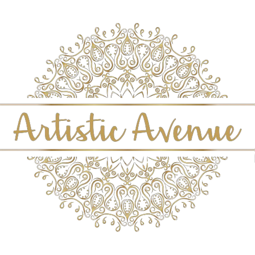

<div align="center">



# 🎨 Artistic Avenue

### *Where Art Meets the World*

**A full-stack art marketplace connecting artists and art lovers — buy, sell, chat, and celebrate art.**

<br/>

[](https://artistic-avenue.onrender.com)
[](https://djangoproject.com)
[](https://neon.tech)
[](https://render.com)
[](https://python.org)

</div>

---

## 🚀 Try It Live

> **[https://artistic-avenue.onrender.com](https://artistic-avenue.onrender.com)**

| 🎭 Role | 🔑 Phone / ID | 🔒 Password |
|--------|-------------|------------|
| 👤 User (Art Buyer) | `9999900002` | `demo@user` |
| 🎨 Artist | `9999900001` | `demo@artist` |
| 🛡️ Admin Portal | ID: `admin001` | `admin123` |

> ⚡ *Free tier — may take 30 seconds to wake up on first visit.*

---

## ✨ What is Artistic Avenue?

Artistic Avenue is a **complete art ecosystem** — a platform where:

- 🎨 **Artists** showcase their work, sell art, host events, and connect with buyers
- 🛍️ **Art Lovers** discover and buy unique artwork, chat with artists, and learn through tutorials
- 🛡️ **Admins** manage the entire platform — users, orders, content, and events

---

## 🖼️ Feature Highlights

<details>
<summary><b>👤 User / Art Buyer Features</b></summary>

<br/>

- ✅ Register & login with phone number
- 🖼️ Browse the full **Gallery** — every artwork on the platform
- 🛒 Visit the **Shop** — artworks available for purchase
- 💳 Place orders with **payment screenshot upload**
- 💬 **Chat directly** with any artist
- 📦 Track your **order history & status**
- 📚 Watch **tutorial videos** & download **PDF study materials**
- 📩 Submit queries via contact form

</details>

<details>
<summary><b>🎨 Artist Features</b></summary>

<br/>

- ✅ Register with art category (Painting, Sculpture, Digital Art, etc.)
- 🏠 Personal **Artist Dashboard** — manage art & orders at a glance
- 📤 Upload artworks with image, price, description
- 🏷️ Toggle artworks **For Sale / Not For Sale**
- 💬 Reply to **user messages**
- 🎪 Create & manage **Events** — exhibitions, workshops, shows
- 📦 View and track all **incoming orders**

</details>

<details>
<summary><b>🛡️ Admin / Portal Features</b></summary>

<br/>

- 🔐 Secure admin login with portal ID & password
- 👥 View all **Users, Artists, Artworks, Orders, Queries**
- 📊 Full **dashboard** with platform statistics
- 🔄 Update **order status** — Pending → Confirmed → Delivered
- 📹 Upload **tutorial videos** (YouTube links) by category
- 📄 Upload **PDF study materials** by category
- 🎪 Create platform-wide **Events**

</details>

---

## 🛒 How Buying Works

```
🔍 Browse Shop
      ↓
🖼️ Select Artwork
      ↓
💳 Billing Page — Upload Payment Screenshot
      ↓
📦 Order Created
      ↓
🎨 Artist Notified
      ↓
🛡️ Admin Updates Status
      ↓
✅ Delivered!
```

---

## 🗃️ Data Models

```
Artist ──────┐
             ├──► Art ──► Order ◄── User
Portal ──────┘      
             
Artist ◄──── Chat ────► User

Artist / Portal ──► Event

Portal ──► Video
Portal ──► Pdf

User ──► Query
```

| Model | Purpose |
|-------|---------|
| `Artist` | Artist profile — name, phone, email, category, photo |
| `User` | Buyer profile — name, phone, email, photo |
| `Portal` | Admin account |
| `Art` | Artwork — title, description, price, image, for-sale & sold flags |
| `Order` | Purchase — user, artwork, payment proof, status |
| `Chat` | Messages between users and artists |
| `Event` | Exhibitions & workshops — name, date, venue, image |
| `Video` | Tutorial videos (YouTube links) by category |
| `Pdf` | Study material PDFs by category |
| `Query` | Contact form submissions |

---

## 🏗️ Project Structure

```
Artistic_Avenue/
│
├── 📄 manage.py
├── 📄 requirements.txt
├── 📄 Procfile                  ← Render start command
├── 📄 build.sh                  ← Render build script
├── 📄 .gitignore
│
├── 📁 Artistic_Avenue/          ← Django project config
│   ├── settings.py
│   ├── urls.py
│   └── wsgi.py
│
└── 📁 aa_app/                   ← Main application
    ├── models.py                ← All database models
    ├── views.py                 ← All views (user, artist, admin)
    ├── urls.py                  ← URL routing
    ├── admin.py
    ├── migrations/
    ├── 📁 static/
    │   ├── css/style.css
    │   └── images/              ← Logo, favicon, backgrounds
    └── 📁 templates/
        ├── html/                ← Public pages
        ├── user/                ← User portal
        ├── artist/              ← Artist portal
        ├── portal/              ← Admin portal
        └── common/              ← Shared partials
```

---

## ⚡ Quick Start (Run Locally)

```bash
# 1. Clone the repo
git clone https://github.com/tripathik9559/Artistic_Avenue.git
cd Artistic_Avenue

# 2. Create virtual environment
python -m venv venv
venv\Scripts\activate        # Windows
# source venv/bin/activate   # Mac / Linux

# 3. Install dependencies
pip install -r requirements.txt

# 4. Run migrations
python manage.py migrate

# 5. Start server
python manage.py runserver
```

🌐 Open **http://127.0.0.1:8000**

---

## ☁️ Deployment Stack

| Layer | Technology |
|-------|-----------|
| 🌐 Hosting | [Render](https://render.com) — Free tier |
| 🗄️ Database | [Neon](https://neon.tech) — PostgreSQL (Free tier) |
| 📦 Static Files | WhiteNoise |
| 🖥️ WSGI Server | Gunicorn |
| 🐍 Runtime | Python 3.11 |

### Environment Variables

| Variable | Value |
|----------|-------|
| `DATABASE_URL` | Neon PostgreSQL connection string |
| `SECRET_KEY` | Django secret key |
| `DEBUG` | `False` |
| `PYTHON_VERSION` | `3.11.0` |

### Render Commands
```bash
# Build
chmod +x build.sh && ./build.sh

# Start
gunicorn Artistic_Avenue.wsgi:application
```

---

## 🔧 Tech Stack

<div align="center">

| | Technology |
|--|-----------|
| 🐍 | Python 3.11 |
| 🌐 | Django 5.2 |
| 🗄️ | PostgreSQL (Neon) |
| 🎨 | HTML5, CSS3, JavaScript |
| ⚡ | WhiteNoise (static files) |
| 🖥️ | Gunicorn (production server) |
| ☁️ | Render (hosting) |

</div>

---

## 🗺️ URL Map

| URL | Page |
|-----|------|
| `/` | Home |
| `/gallery/` | All Artworks |
| `/shop/` | Buy Art |
| `/artists/` | All Artists |
| `/events/` | Events |
| `/tutorials/` | Videos & PDFs |
| `/user_login/` | User Login |
| `/artist_login/` | Artist Login |
| `/portal/` | Admin Login |

---

<div align="center">

Made with ❤️ for the love of Art

**[🌐 Visit Artistic Avenue](https://artistic-avenue.onrender.com)**

</div>
